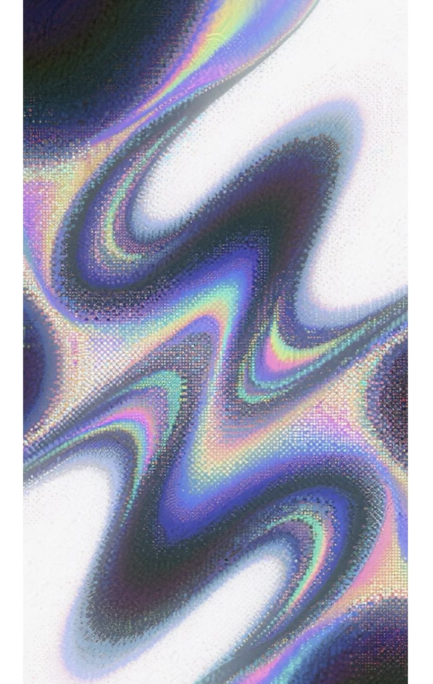

# Who's free, gdmit

**Find the quietest hour for the whole group.** Everyone marks when they are busy; the room finds the overlap with the fewest conflicts.

## Demo

Open the live Vercel demo: **[whos-free-gdmit.vercel.app](https://whos-free-gdmit.vercel.app/)**

The landing page is an interactive visual demo as well as the entry point:

- Move the pointer around the hero. The solid chrome title tilts around the center of the complete title.
- Scroll down to reveal the create/join panel while the animated wave background stays fixed.
- Press **Pause motion** for a still frame. The site also respects `prefers-reduced-motion`.

The background is a continuous shader-driven wave, not a slideshow. Seven supplied visual references flow through one moving surface, shifting spatially between holographic, chrome, halftone, and grid treatments.




## How to use it

1. Enter your name.
2. Select **Making a legit plan..** to create a group room and receive a five-digit Plan ID.
3. Share that Plan ID. Other people enter it under **Plan ID num** and select **Join**.
4. In the room calendar, double-click a day to open its 24-hour strip.
5. Click the hours when you are busy. Selected hours lock with a short padlock animation; press `Esc` to return to the month.
6. Confirm your schedule. When the group is ready, the room ranks the lowest-conflict shared hours across everyone’s overlapping date range and timezone.

## What the app does

- Captures each participant’s IANA timezone from the browser.
- Keeps each person’s busy hours as local calendar intent, then compares them as UTC instants so timezones and daylight-saving changes are handled correctly.
- Uses the intersection of all submitted date windows. If one person covers the 20th–26th and another covers the 24th–30th, the calculation considers the 24th–26th.
- Sends room progress through Socket.io when available and refreshes the authoritative result from the API after reconnects.
- Shows a translucent enchanted glint over calendar days with busy hours while preserving the day’s original color.

## Visual system: AI-assisted reference composition

The moving background is an AI-assisted creative composition based on the seven reference pictures supplied by the project owner. The renderer does not crossfade between slides: a fragment shader uses a shared wave field to deform the images and blend neighboring designs continuously. The chrome title is a separate beveled GLB model rendered with a metallic studio setup.

The visual contract is recorded in [`docs/visual-contract.json`](docs/visual-contract.json), and the structural ground truth remains [`docs/ARCHITECTURE.md`](docs/ARCHITECTURE.md).

### Reference credits and provenance

The seven raster files in `public/textures/waves/` were supplied directly in this project’s design conversation. Pinterest is an image-discovery service and a pin is not necessarily the original author. Because the supplied files contain no embedded author metadata, this repository does **not** claim Pinterest or a search result as the creator when an exact match could not be verified.

The attribution audit, including confirmed source leads and unresolved items, is in [`docs/REFERENCES.md`](docs/REFERENCES.md). The strongest searchable leads currently include [YouWorkForThem’s Prismatic Chrome Lens effect pin](https://in.pinterest.com/pin/prismatic-chrome-lens-photo-effect-youworkforthem--809944314263001417/), a [Freepik wireframe-grid pin](https://in.pinterest.com/pin/retro-wave-synthases-grid-patterns-wireframe-grid-backgrounds-in-black-and-white-colors--445223113180531800/), and a [Shutterstock halftone-stars pin](https://in.pinterest.com/pin/stars-pattern-vector-halftone-texture-abstract-stock-vector-royalty-free-2153333789--393502086202945355/). These are documented as leads, not definitive authorship claims, until the original pins can be matched to the supplied rasters.

## Stack

- Next.js App Router, React, and TypeScript for the room UI
- Three.js for the client-only flowing background and chrome title
- Express, MongoDB, and Socket.io for the canonical five-digit room API
- Luxon/Zod for timezone-aware validation and data contracts

## Local setup

1. Install dependencies:

   ```powershell
   npm install
   npm install --prefix apps/server
   ```

2. Copy `.env.example` to `.env.local`.
3. Set `MONGODB_URI` and `MONGODB_DB`. Set `API_BASE_URL` and `NEXT_PUBLIC_API_URL` to the reachable Express server, for example `http://localhost:4000`. The legacy `/api/v1/plans` routes also require `ABLY_API_KEY` if used.
4. Start the API and web app in separate terminals:

   ```powershell
   npm run dev --prefix apps/server
   npm run dev
   ```

On Windows, if Node cannot resolve a MongoDB Atlas SRV record, run `pwsh -File scripts/start-phase1-api.ps1` to resolve the same public seed list through Windows DNS without changing credentials.

## Verification

```powershell
npm run check:architecture
npm run typecheck
npm test --prefix apps/server
npm run build
```

## Documentation ground truth

All structural route, model, and event decisions live in [`docs/ARCHITECTURE.md`](docs/ARCHITECTURE.md), [`docs/API_ROUTES.md`](docs/API_ROUTES.md), and [`docs/DATABASE_SCHEMA.md`](docs/DATABASE_SCHEMA.md). Obsidian-compatible notes live under [`documentation/obsidian/`](documentation/obsidian/). Update those contracts in the same change whenever the architecture changes.

## Deployment

The web app is deployed at [whos-free-gdmit.vercel.app](https://whos-free-gdmit.vercel.app/). Deploy `apps/server` as its own Vercel Express project with `MONGODB_URI` and `MONGODB_DB`, then set the web project’s `API_BASE_URL` to the server’s public HTTPS origin. A persistent Node host can also run Express/Socket.io for the best live-event behavior; the browser retains API refresh fallback for serverless deployments.
